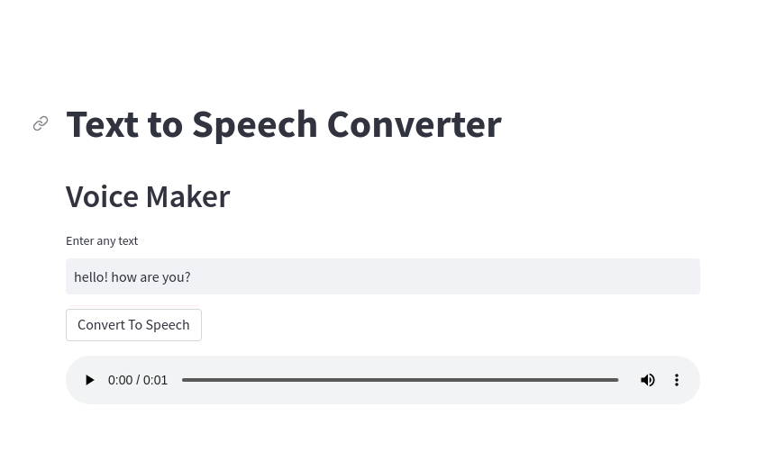

# Text to Speech Converter 

**Voice Maker is a webapp and Python package that converts text into Speech*

---
<h3 align="center">
    🎈 Try it out here: <a href="https://voicemaker.streamlit.app/">Voice Maker on streamlit 🎈 </a>
</h3>

---


<p align="center">
    <a href="https://voicemaker.streamlit.app/"></a>
</p>

<br>

## Based on the Voice Maker project

A text-to-speech (TTS) system converts written text to spoken voice. It is also known as a speech synthesizer. TTS systems are commonly used to create audio versions of written content, such as books or news articles, for people who prefer to listen rather than read. They are also used in speech-based assistive technologies, such as screen readers for visually impaired users and voice assistants for hands-free computing. TTS systems use a combination of linguistic and phonetic knowledge, along with synthesized speech waveforms, to generate spoken output that sounds natural to the listener.

## Python package

You can also use this project without the webapp, directly in Python. This lets you customize the functionality or 
build your own application.

**Installation:**

```bash
pip install gtts
```

```python
ffrom gtts import gTTS

print("Text to Speech Converter")
print("Voice Maker")

text = 'Hello! How are you?'
try:
    tts = gTTS(text,slow = False)
    tts.save("audio.mp3")
except:
    print("Kindly Reload the application")
